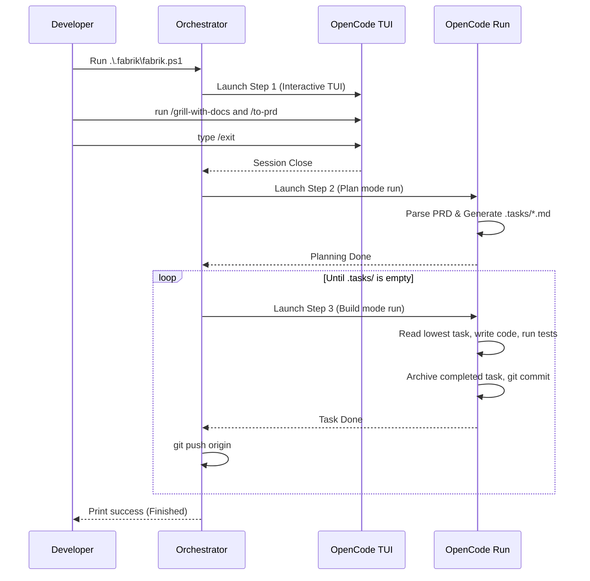

# AI-Agent Engineering Playbook: The Fabrik Method

This document defines a strict, structured workflow for collaborating with AI coding agents. It is designed to work like a feature factory (**Fabrik**), maximizing output predictability, enforcing rigorous testing backpressure, and eliminating conversational bloat.

---

## 1. Battle-Tested Community Skills

Instead of writing skills from scratch, we utilize the official **[mattpocock/skills](https://github.com/mattpocock/skills)** library. These are added directly to your agent's configuration using `npx`:

```bash
# Add the core engineering skills bundle to OpenCode
npx -y skills add mattpocock/skills --agent opencode
```

### Official Skills Mapping for this Playbook

| Workflow Step | Battle-Tested Skill | Trigger Command | Description |
| :--- | :--- | :--- | :--- |
| **Step 1: Ideation / Align** | `grill-with-docs` | `/grill-with-docs` | Interrogates you one question at a time to stress-test your plan. Updates your local `.fabrik/CONTEXT.md` to build a shared project language. |
| **Step 2: PRD Generation** | `to-prd` | `/to-prd` | Summarizes details from your grilling conversation directly into `.fabrik/docs/PRD.md`. |
| **Step 3: Issue Partitioning**| `to-issues` | `/to-issues` | Scans the PRD and extracts it into decoupled issue files in `.fabrik/.tasks/`. |
| **Step 5: Testing / TDD** | `tdd` | `/tdd` | Restricts the agent to vertical slices (red-green-refactor) instead of bulk changes. |
| **Caveman Everywhere** | `caveman` | `/caveman` | Enforces short, apologizing-free, blunt speech on all agent output. |

---

## 2. Directory Layout

All agent-coordination files live inside a self-contained `.fabrik/` folder, keeping your project's root folder clean:

```
project-root/
├── .fabrik/                        # All workflow coordination files live here!
│   ├── .tasks/                     # Open task files (created by planning mode)
│   │   ├── 001-setup-db.md
│   │   └── completed/              # Archived completed tasks
│   ├── docs/
│   │   └── PRD.md                  # Product Requirements Document
│   ├── specs/                      # High-level architecture / specs
│   ├── styleguide/                 # Code standards directory
│   │   └── STYLEGUIDE.md           # Modular coding & strict typing rules
│   ├── setup.ps1                   # Initial setup script (PowerShell)
│   ├── setup.sh                    # Initial setup script (Bash)
│   ├── loop.ps1                    # PowerShell loop runner (runs opencode)
│   ├── loop.sh                     # Bash loop runner (runs opencode)
│   ├── fabrik.ps1                  # Master Orchestrator (PowerShell)
│   ├── fabrik.sh                   # Master Orchestrator (Bash)
│   ├── PROMPT_plan.md              # Plan agent instructions
│   ├── PROMPT_build.md             # Build agent instructions
│   ├── AGENTS.md                   # Caveman rules and validation steps
│   └── CONTEXT.md                  # Project dictionary & domain modeling
├── src/                            # Source code
├── package.json
└── tsconfig.json
```

---

## 3. Back-to-Back Master Flow

To run the entire pipeline autonomously with a single startup trigger, use the **Master Orchestrator**:
*   **Windows (PowerShell):** `.\.fabrik\fabrik.ps1`
*   **Linux/macOS:** `./.fabrik/fabrik.sh`



---

## 4. Optimal Terminal Environment Setup

For the best monitoring and iteration speed, we recommend using a split-terminal multiplexer (like VS Code Terminal Splits, Windows Terminal, or tmux) split into **three specific panes**:

### Pane 1: The Factory Floor (Master Loop)
*   **Purpose:** Run `.\fabrik.ps1` or `./fabrik.sh` here.
*   **Usage:** You start the loop, interact with the initial grill session, and then watch the streaming logs as the agent builds, tests, and commits.
*   **Key Value:** Keeps you in control of the loop trajectory.

### Pane 2: The Control Room (Manual Code/Git Inspection)
*   **Purpose:** Active codebase terminal.
*   **Usage:** Used to run manual git checks, inspect diffs (`git diff`), examine logs, and make manual adjustments if the agent gets stuck on a complex pattern.

### Pane 3: Continuous Backpressure Monitor (Live Watcher)
*   **Purpose:** An active, continuous watcher for tests and builds.
*   **Usage:** Run your project's unit tests in watch mode here (e.g., `npm run test -- --watch` or `vitest`).
*   **Key Value:** Gives you instantaneous visual feedback as the agent edits files in Pane 1, allowing you to catch regression errors before the agent completes its cycle.
