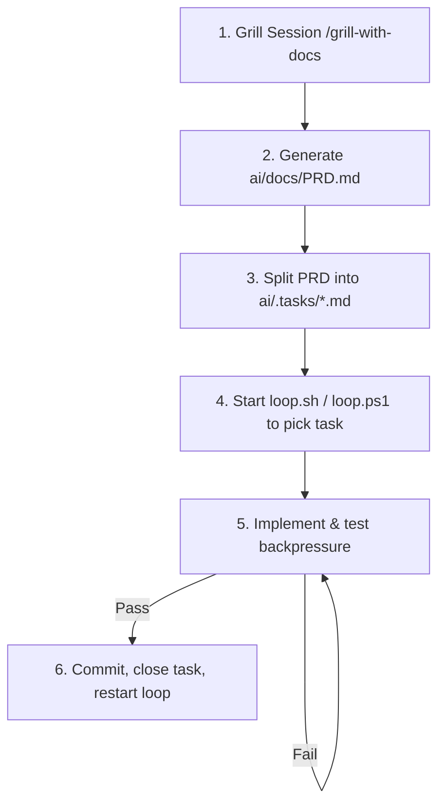

# AI-Agent Engineering Playbook: The Fabrik Method

This document defines a strict, structured workflow for collaborating with AI coding agents. It is designed to work like a feature factory (**Fabrik**), maximizing output predictability, enforcing rigorous testing backpressure, and eliminating conversational bloat.

---

## 1. Battle-Tested Community Skills

Instead of writing skills from scratch, we utilize the official **[mattpocock/skills](https://github.com/mattpocock/skills)** library. These are added directly to your agent's configuration using `npx`:

```bash
# Add the core engineering skills bundle to OpenCode
npx -y skills add mattpocock/skills --agent opencode
```

### Official Skills Mapping for this Playbook

| Workflow Step | Battle-Tested Skill | Trigger Command | Description |
| :--- | :--- | :--- | :--- |
| **Step 1: Ideation / Align** | `grill-with-docs` | `/grill-with-docs` | Interrogates you one question at a time to stress-test your plan. Updates your local `ai/CONTEXT.md` to build a shared project language. |
| **Step 2: PRD Generation** | `to-prd` | `/to-prd` | Summarizes details from your grilling conversation directly into `ai/docs/PRD.md`. |
| **Step 3: Issue Partitioning**| `to-issues` | `/to-issues` | Scans the PRD and extracts it into decoupled issue files in `ai/.tasks/`. |
| **Step 5: Testing / TDD** | `tdd` | `/tdd` | Restricts the agent to vertical slices (red-green-refactor) instead of bulk changes. |
| **Caveman Everywhere** | `caveman` | `/caveman` | Enforces short, apologizing-free, blunt speech on all agent output. |

---

## 2. Directory Layout

All agent-coordination files live inside a self-contained `ai/` folder, keeping your project's root folder clean:

```
project-root/
├── ai/                             # All workflow coordination files live here!
│   ├── .tasks/                     # Open task files (created by planning mode)
│   │   ├── 001-setup-db.md
│   │   └── completed/              # Archived completed tasks
│   ├── docs/
│   │   └── PRD.md                  # Product Requirements Document
│   ├── specs/                      # High-level architecture / specs
│   ├── styleguide/                 # Code standards directory
│   │   └── STYLEGUIDE.md           # Modular coding & strict typing rules
│   ├── loop.ps1                    # PowerShell loop runner (runs opencode)
│   ├── loop.sh                     # Bash loop runner (runs opencode)
│   ├── PROMPT_plan.md              # Plan agent instructions
│   ├── PROMPT_build.md             # Build agent instructions
│   ├── AGENTS.md                   # Caveman rules and validation steps
│   └── CONTEXT.md                  # Project dictionary & domain modeling
├── src/                            # Source code
├── package.json
└── tsconfig.json
```

---

## 3. The 6-Step Workflow via `opencode`



### Step 1: Grill & Align
*   **Action:** Run OpenCode and trigger `/grill-with-docs`.
*   **Result:** A refined scope and terminology saved to [CONTEXT.md](file:///D:/projects/fabrik/ai/CONTEXT.md).

### Step 2: Generate the PRD
*   **Action:** Trigger `/to-prd` in OpenCode to output requirements to [docs/PRD.md](file:///D:/projects/fabrik/ai/docs/PRD.md).

### Step 3: PRD-to-Issues (Scope Splitting)
*   **Action:** Run OpenCode with the plan agent (`loop.ps1 -Mode plan` / `loop.sh plan`).
*   **Result:** Decoupled vertical slice task files created inside `ai/.tasks/`.

### Step 4: Automatic Work Loop
*   **Action:** Start the work loop (`loop.ps1 -Mode build` / `loop.sh build`).
*   **Objective:** The script boots OpenCode in build mode (`opencode --agent build`), which reads `ai/.tasks/`, selects the lowest-numbered open task, and starts coding.

### Step 5: Test & Lint Backpressure
*   **Action:** OpenCode implements code under `src/` and runs your tests (defined in `ai/AGENTS.md`). It self-corrects until tests are green.

### Step 6: Commit & Close Issue
*   **Action:** OpenCode moves the task to `ai/.tasks/completed/`, stages files, commits with `closes #[task]`, pushes, and exits. The loop immediately restarts with a fresh context.
