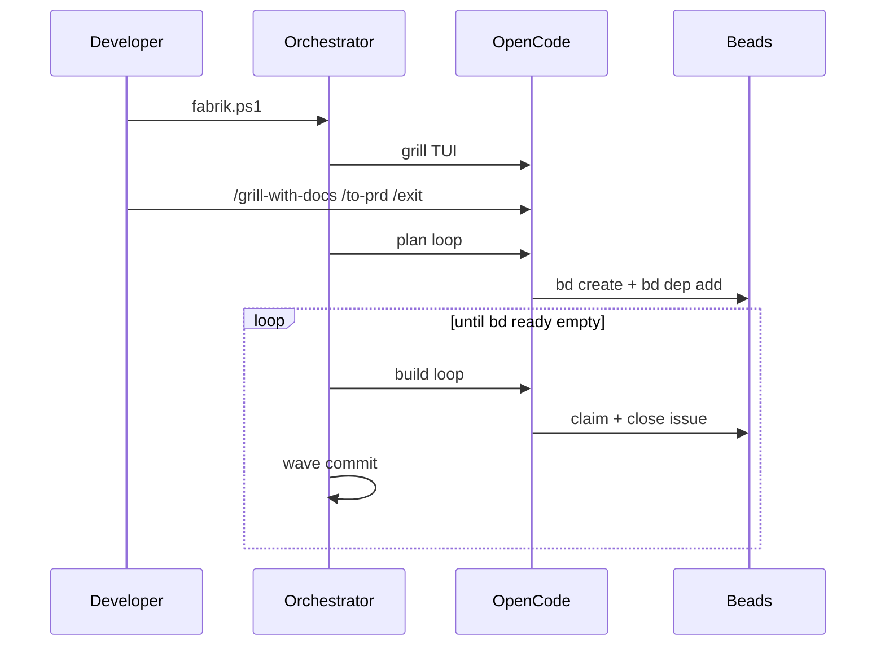

# Fabrik Method

Structured AI workflow for Cursor, OpenCode, and Pi. One session loop everywhere. Beads is the task store.

---

## 1. Skills

Install via `npx` (done by `.fabrik/setup.*`):

```bash
npx -y skills add mattpocock/skills --agent opencode
```

| Step | Skill | Command | Output |
|------|-------|---------|--------|
| Align | `grill-with-docs` | `/grill-with-docs` | Stress-test plan, update `.fabrik/CONTEXT.md` |
| PRD | `to-prd` | `/to-prd` | `.fabrik/docs/PRD.md` |
| Land | `to-issues` | `/to-issues` | `bd create` issues (not markdown files) |
| Build | `tdd` | `/tdd` | Vertical slices only |
| Style | `caveman` | `/caveman` | Minimal agent output |

---

## 2. Directory layout

```
project-root/
├── .beads/                 # Beads issue DB (embedded Dolt)
├── .fabrik/
│   ├── docs/PRD.md
│   ├── specs/
│   ├── styleguide/STYLEGUIDE.md
│   ├── CONTEXT.md
│   ├── config.yaml
│   ├── PROMPT_plan.md
│   ├── PROMPT_build.md
│   ├── AGENTS.md
│   ├── fabrik.ps1 / fabrik.sh
│   └── loop.ps1 / loop.sh
├── install/                # Machine setup (in Fabrik repo only)
│   ├── setup.ps1 / setup.sh
│   ├── init.ps1 / init.sh
│   └── deps.json
└── src/
```

Tasks live in Beads. `.fabrik/` holds specs, prompts, and orchestration — not a second backlog.

---

## 3. Session loop

1. **Orient** — Engram + optional Graphify.
2. **Align** — Grill, optional PRD.
3. **Land** — `bd create`, `bd dep add`.
4. **Build** — `bd ready` → claim → backpressure → `bd close`.
5. **Remember** — Engram `mem_save`, `mem_session_summary`.

### AFK orchestrator

- Windows: `.\.fabrik\fabrik.ps1`
- Unix: `./.fabrik/fabrik.sh`


```mermaid
sequenceDiagram
    participant Dev as Developer
    participant Orch as Orchestrator
    participant OC as OpenCode
    participant BD as Beads

    Dev->>Orch: fabrik.ps1
    Orch->>OC: grill TUI
    Dev->>OC: /grill-with-docs /to-prd /exit
    Orch->>OC: plan loop
    OC->>BD: bd create + bd dep add
    loop until bd ready empty
        Orch->>OC: build loop
        OC->>BD: claim + close issue
        Orch->>Orch: wave commit
    end
```

---

## 4. Machine setup

Run once per machine from the Fabrik repo:

```powershell
.\install\setup.ps1
```

```bash
./install/setup.sh
```

Per target repo:

```powershell
.\install\init.ps1 .
```

---

## 5. Terminal layout

| Pane | Purpose |
|------|---------|
| Factory | `fabrik.ps1` / `fabrik.sh` — watch the loop |
| Control | Manual `git diff`, inspect code |
| Backpressure | Project test watcher (`bun test --watch`, etc.) |

Use whatever test/lint/build commands the target repo defines in `AGENTS.md`.
