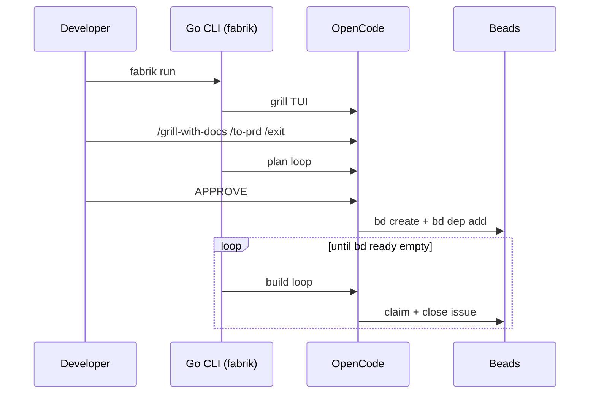

# Fabrik Method

Structured AI workflow for Cursor, OpenCode, and Pi. One session loop everywhere. Beads is the task store.

---

## 1. Skills

Installed by `fabrik setup` (or added per-app):

| Step | Skill | Command | Output |
|------|-------|---------|--------|
| Align | `grill-with-docs` | `/grill-with-docs` | Stress-test plan, update `.fabrik/CONTEXT.md` |
| PRD | `to-prd` | `/to-prd` | `.fabrik/docs/PRD.md` |
| Plan | plan agent | (default session) | `.fabrik/specs/<slug>.md` for review |
| Land | `to-issues` / planner | after APPROVE | `bd create` issues (not markdown backlog files) |
| Build | `tdd` | `/tdd` | Vertical slices only |
| Style | `i-have-adhd` | `/i-have-adhd` | ADHD-friendly output: next action first, numbered steps, Done/Next |

---

## 2. Directory layout

```
project-root/
├── .beads/                 # Beads issue DB (embedded Dolt)
├── .fabrik/
│   ├── docs/PRD.md
│   ├── specs/
│   └── config.yaml
├── cli/                    # Standalone Go CLI
└── install/                # Pinned dependencies & templates
```

Tasks live in Beads. `.fabrik/` holds specs, PRDs, and config — hub content is served directly by the Go CLI (`fabrik show`).

---

## 3. Session loop

1. **Orient** — Engram + optional Graphify.
2. **Plan** — plan agent writes `.fabrik/specs/` + chat; user APPROVE or REVIEW.
3. **Land** — after APPROVE: planner runs `bd create`, `bd dep add` (skip if issue exists).
4. **Build** — orchestrator: builder + tester → `bd ready` → claim → backpressure → `bd close`.
5. **Remember** — Engram `mem_save`, `mem_session_summary`.

### AFK orchestrator

- Run workflow: `fabrik run [--auto -p "goals"]`
- Run loops: `fabrik loop plan` / `fabrik loop build [--max N]`


```mermaid
sequenceDiagram
    participant Dev as Developer
    participant Orch as Go CLI (fabrik)
    participant OC as OpenCode
    participant BD as Beads

    Dev->>Orch: fabrik run
    Orch->>OC: grill TUI
    Dev->>OC: /grill-with-docs /to-prd /exit
    Orch->>OC: plan loop
    Dev->>OC: APPROVE
    OC->>BD: bd create + bd dep add
    loop until bd ready empty
        Orch->>OC: build loop
        OC->>BD: claim + close issue
    end
```

---

## 4. Machine setup

Run once per machine:

```bash
go install github.com/ur-wesley/fabrik/cli/cmd/fabrik@latest
fabrik setup
```

Per target repo:

```bash
fabrik init .
```

---

## 5. Terminal layout

| Pane | Purpose |
|------|---------|
| Factory | `fabrik loop build` — watch the loop |
| Control | Manual `git diff`, inspect code |
| Backpressure | Project test watcher (project-specific) |

Use whatever test/lint/build commands the target repo defines in `AGENTS.md`.
